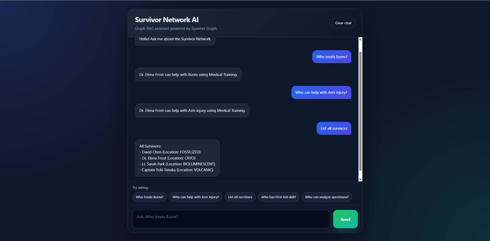

# Survivor Network AI

AI-powered Graph RAG assistant built with **Google Cloud Spanner Graph**, **FastAPI**, **Google ADK**, and **React**.

This project simulates a survivor rescue network where each survivor has skills, needs, locations, and relationships. The assistant can reason over graph data to answer questions such as:

- Who treats Burns?
- Who can help with Arm injury?
- Who has First Aid skill?
- List all survivors

Core reasoning path:

```text
Survivor → Skill → Need
```

Example:

```text
Dr. Elena Frost → Medical Training → Burns
```

---

## Live Demo

- Frontend: [<YOUR_FRONTEND_URL>](https://survivor-network-ui-y3rxpbgf6q-uc.a.run.app)
- Backend API: [<YOUR_BACKEND_URL>](https://survivor-network-api-y3rxpbgf6q-uc.a.run.app)

Try these prompts:

```text
Who treats Burns?
Who can help with Arm injury?
Who has First Aid skill?
List all survivors

## Demo



Example interaction:

```text
User: Who treats Burns?
Assistant: Dr. Elena Frost can help with Burns using Medical Training.
```

```text
User: Who can help with Arm injury?
Assistant: Dr. Elena Frost can help with Arm injury using Medical Training.
```

---

## Key Features

- FastAPI backend for chat and graph APIs
- Google Cloud Spanner Graph database
- Multi-hop graph reasoning over survivors, skills, and needs
- Google ADK agent integration
- Hybrid / semantic search support
- Deterministic graph fallback for reliable helper lookup
- React + Vite chat UI
- Auto-scroll chat experience
- Clear chat action
- Sample prompt buttons for quick demos
- Cloud Shell friendly setup

---

## Why Graph RAG?

A normal chatbot may rely mostly on text similarity.

This project uses graph relationships to reason through connected data.

For example, to answer:

```text
Who treats Burns?
```

the system follows this graph path:

```text
Burns
← SkillTreatsNeed
Medical Training
← SurvivorHasSkill
Dr. Elena Frost
```

So the assistant can answer:

```text
Dr. Elena Frost can help with Burns using Medical Training.
```

---

## Architecture

```text
React Frontend
  ↓
FastAPI Backend
  ↓
Google ADK Agent
  ↓
Graph Tools / Search Tools
  ↓
Cloud Spanner Graph
```

Main graph relationship:

```text
Survivors -[SurvivorHasSkill]-> Skills -[SkillTreatsNeed]-> Needs
```

Deterministic helper lookup:

```sql
GRAPH SurvivorNetwork
MATCH (s:Survivors)-[:SurvivorHasSkill]->(sk:Skills)-[:SkillTreatsNeed]->(n:Needs)
WHERE LOWER(n.description) = LOWER(@need_description)
RETURN s.name AS helper, sk.name AS skill, n.description AS need
```

---

## Tech Stack

### Frontend

- React
- TypeScript
- Vite
- CSS

### Backend

- Python
- FastAPI
- Uvicorn
- Google ADK

### Cloud / Data

- Google Cloud
- Cloud Spanner Graph
- Vertex AI / Gemini
- Google Cloud Storage

---

## Project Structure

```text
survivor-network-ai/
  backend/
    agent/
    api/
    config/
    extractors/
    models/
    services/
    main.py
    setup_data.py
    pyproject.toml

  frontend/
    src/
    public/
    package.json
    vite.config.ts

  scripts/
  init.sh
  setup.sh
  README.md
```

Main folders:

- `backend/` — FastAPI backend, ADK agent, graph tools, Spanner services
- `frontend/` — React chat UI
- `scripts/` — supporting setup scripts

---

## Cloud Shell Quick Start

This project is designed to run well in **Google Cloud Shell Editor**.

> This project requires a Google Cloud account with billing enabled because it uses Cloud Spanner Graph, Vertex AI / Gemini, and Cloud Storage.

### 1. Clone the repository

```bash
git clone https://github.com/vuongnguyen-se/survivor-network-ai.git
cd survivor-network-ai
```

### 2. Authenticate Google Cloud

```bash
gcloud auth list
gcloud auth application-default login
```

### 3. Initialize Google Cloud resources

```bash
./init.sh
./setup.sh
```

These scripts configure:

```text
Google Cloud project
Billing link
Cloud Storage bucket
Spanner configuration
.env file
```

The `.env` file is generated locally and should not be committed to GitHub.

### 4. Load sample graph data

```bash
cd backend
uv sync
uv run python setup_data.py
```

This creates the sample Survivor Network graph database.

Expected resources:

```text
Instance: survivor-network
Database: graph-db
Graph: SurvivorNetwork
```

---

## Run Locally in Cloud Shell

### Backend

Open terminal 1:

```bash
cd backend

set -a
source ../.env
set +a

uv run uvicorn main:app --host 0.0.0.0 --port 8080 --reload
```

Backend runs on:

```text
http://localhost:8080
```

### Frontend

Open terminal 2:

```bash
cd frontend
npm install
npm run dev -- --host 0.0.0.0
```

Frontend runs on:

```text
http://localhost:5173
```

In Google Cloud Shell, open:

```text
Web Preview → Preview on port 5173
```

---

## API Examples

### Get graph data

```bash
curl -s http://localhost:8080/api/graph
```

### Ask the assistant

```bash
curl -X POST http://localhost:8080/api/chat \
  -H "Content-Type: application/json" \
  -d '{"message":"Who treats Burns?","conversation_id":"demo-1"}'
```

Expected response:

```json
{
  "answer": "Dr. Elena Frost can help with Burns using Medical Training.",
  "gql_query": null,
  "nodes_to_highlight": [],
  "edges_to_highlight": [],
  "suggested_followups": []
}
```

---

## Spanner Graph Query Example

To visualize graph reasoning in Spanner Studio:

```sql
GRAPH SurvivorNetwork
MATCH result = (s:Survivors)-[:SurvivorHasSkill]->(sk:Skills)-[:SkillTreatsNeed]->(n:Needs)
RETURN TO_JSON(result) AS graph_result
```

To find who treats Burns:

```sql
GRAPH SurvivorNetwork
MATCH result = (s:Survivors)-[:SurvivorHasSkill]->(sk:Skills)-[:SkillTreatsNeed]->(n:Needs)
WHERE n.description = "Burns"
RETURN TO_JSON(result) AS graph_result
```

Expected path:

```text
Dr. Elena Frost → Medical Training → Burns
```

---

## Example Questions

Try these prompts in the UI:

```text
Who treats Burns?
Who can help with Arm injury?
Who can analyze specimens?
Who has First Aid skill?
List all survivors
List all skills
List all needs
```

---

## What I Built / Customized

This project started from a Google Cloud codelab structure and was refactored into a cleaner portfolio project.

Custom work includes:

- Refactored the repository from a multi-level codelab structure into a clean `backend/` and `frontend/` layout
- Fixed missing backend TODOs for ADK session and runner setup
- Added missing semantic search tool wiring
- Added missing RAG SQL logic in the hybrid search service
- Added deterministic graph fallback tool: `find_helper_by_need`
- Improved agent routing so known needs use graph lookup before semantic search
- Built and connected a React chat UI to the FastAPI backend
- Added Vite proxy configuration for frontend-backend communication
- Added auto-scroll chat behavior
- Added clear chat functionality
- Added sample prompt buttons for easier demos
- Verified backend and frontend after repository refactor
- Added deterministic list tools for survivors, skills, and needs to improve demo reliability without requiring LLM calls.

---

## Deterministic Fallback Strategy

Semantic search and LLM-based routing can fail due to quota limits, model errors, or ambiguous prompts.

To make the system more reliable, this project includes a deterministic fallback:

```text
Known need phrase
→ direct graph query
→ helper + skill result
```

Example:

```text
Who treats Burns?
→ find_helper_by_need("Burns")
→ Dr. Elena Frost can help with Burns using Medical Training.
```

This reduces unnecessary model calls and makes important graph queries more reliable.

---

## Current Limitations

- Semantic search depends on Vertex AI / Gemini availability and quota
- Authentication and production-grade security are not implemented yet
- The current UI focuses on chat, not full 3D graph visualization yet
- The app currently uses sample survivor data
- Cloud resources may incur costs if left running

---

## Roadmap

Planned improvements:

- Add graph visualization for Survivors, Skills, Needs, and relationships
- Add richer mission-control style UI
- Add image/video upload flow for multimodal extraction
- Improve error handling and fallback behavior
- Add persistent memory support
- Add Cloud Run deployment guide
- Add demo screenshots and GIFs to this README

---

## Cost and Cleanup Notes

This project creates Google Cloud resources that may incur costs.

Recommended cleanup after testing:

```bash
gcloud projects delete $(cat ~/project_id.txt)
```

Or manually remove:

```text
Cloud Spanner instance
Cloud Storage bucket
Cloud Run services
Artifact Registry images
```

---

## Attribution

This project is based on the Google Cloud Survivor Network codelab and has been customized with backend fixes, deterministic graph fallback logic, a React chat UI, and a cleaner portfolio-oriented repository structure.